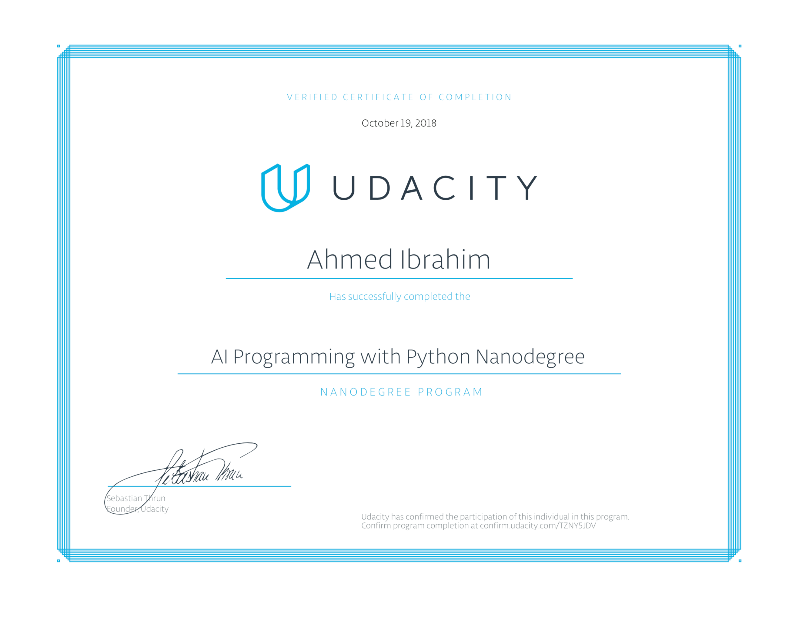

# Udacity_AIPND_Image_Classifier
The Final project of AI Programming with Python Nanodegree - Create Image Classifier using deep learning

# Developing an AI application
Going forward, AI algorithms will be incorporated into more and more everyday applications. For example, you might want to include an image classifier in a smart phone app. 
To do this, you'd use a deep learning model trained on hundreds of thousands of images as part of the overall application architecture.
A large part of software development in the future will be using these types of models as common parts of applications.

In this project, you'll train an image classifier to recognize different species of flowers. You can imagine using something 
like this in a phone app that tells you the name of the flower your camera is looking at. In practice you'd train this classifier,
then export it for use in your application. We'll be using [this dataset](http://www.robots.ox.ac.uk/~vgg/data/flowers/102/index.html)
of 102 flower categories, you can see a few examples below.


# Sanity Checking

Now that you can use a trained model for predictions, check to make sure it makes sense. Even if the testing accuracy is high, 
it's always good to check that there aren't obvious bugs. Use matplotlib to plot the probabilities for the top 5 classes as a bar graph,
along with the input image. It should look like this:


# Setup

You have two main command applications ```train.py``` and ```predict.py``` each program requires some data to function like
the ```train.py``` you need to provide **data_dirctory** , **path for the saved weights**, **number of epochs**


# Certificate 
It was a very special experience thanks [Udacity](https://mena.udacity.com/) 


